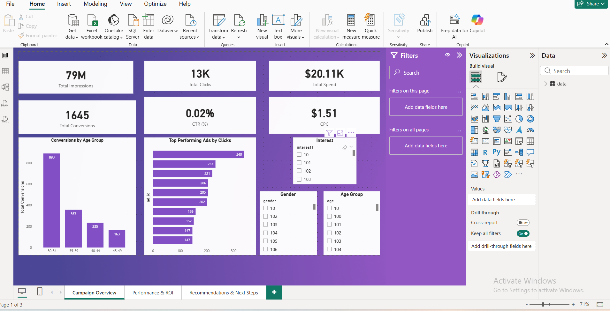

# 📊 Social Media Ad Campaign Performance Dashboard

## 📌 Project Overview
This project presents an end-to-end analysis of social media advertising campaign performance using simulated Facebook and Instagram Ads data. The dashboard was built in Power BI to help stakeholders evaluate campaign effectiveness, identify top-performing ads and audience segments, and optimize future marketing spend.

---

## 🎯 Project Objectives
- Assess overall ad campaign performance
- Identify top-performing ads and campaigns
- Analyze audience engagement and conversion efficiency
- Evaluate cost effectiveness and ROI indicators
- Provide actionable, data-driven recommendations

---

## 🧾 Dataset Description
The dataset contains simulated advertising performance metrics, including:
- Ad and campaign identifiers
- Audience demographics (age, gender, interests)
- Impressions and clicks
- Advertising spend
- Total and approved conversions

---

## 📈 Key Performance Indicators (KPIs)
- Total Impressions  
- Total Clicks  
- Click-Through Rate (CTR)  
- Conversion Rate  
- Cost per Click (CPC)  
- Cost per Conversion  

---

## 📊 Dashboard Visuals
The interactive Power BI dashboard includes:
- Campaign overview with KPI cards
- Conversion performance by age group
- Top-performing ads based on clicks and conversions
- Spend vs conversions analysis by campaign
- Cost per conversion comparison across age segments

### 📸 Dashboard Previews

---

## 🔍 Key Insights
- The **25–34 age group** generated the highest conversion volume at the lowest cost per conversion.
- Certain campaigns incurred **high ad spend with low approved conversions**, negatively impacting ROI.
- High click volume does not always translate into high-quality conversions, highlighting the importance of conversion efficiency over raw engagement.

---

## 📌 Actionable Recommendations
- Increase budget allocation toward high-performing age groups, particularly 25–34.
- Optimize or pause campaigns with low approved conversion rates and high spend.
- Focus on ads driving quality, approved conversions rather than clicks alone.
- Continuously monitor conversion efficiency metrics to guide weekly campaign optimization.

---

## 🛠 Tools & Technologies
- Power BI Desktop  
- Power Query  
- DAX  
- GitHub  

---

## 📁 Repository Structure

---

## 👤 Author
**Stephen Otieno**  
Aspiring Data Scientist | Future Interns Program  

